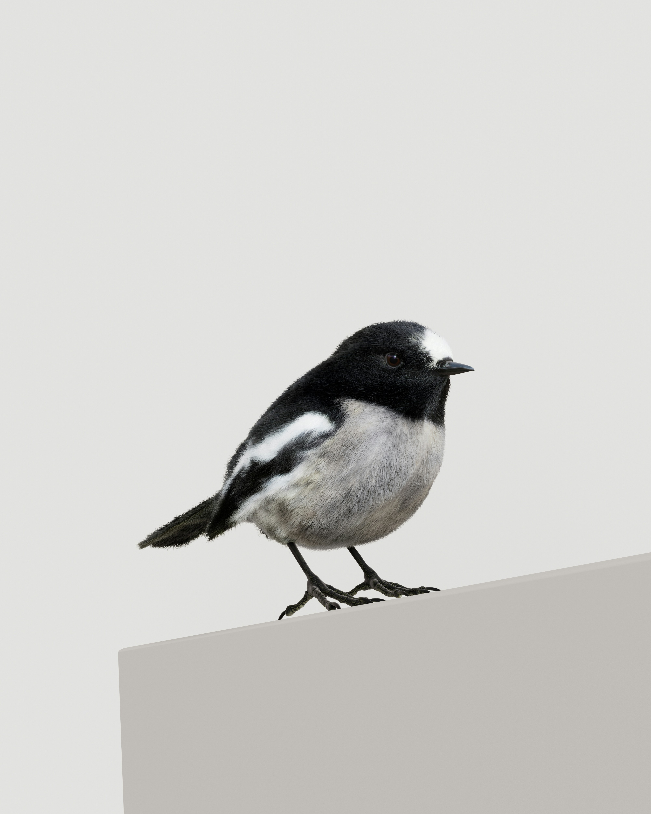

# static-html-template

Use this template to create static HTML websites and deploy them on Render.
<!DOCTYPE html>
<html lang="en">
<head>
    <meta charset="UTF-8">
    <meta name="viewport" content="width=device-width, initial-scale=1.0">
    <title>Kyle Payvar - Link in Bio</title>
    
    <link href="https://fonts.googleapis.com/css2?family=Playfair+Display:wght@700&family=Raleway:wght@400&display=swap" rel="stylesheet">
    
</head>
<body>

    

        
        
Kyle Payvar

    

    

        <a class="link-item" href="https://www.instagram.com/kyle.payvar/" target="_blank">
            
            Instagram
        </a>
        <a class="link-item" href="https://github.com/kpayvar2026" target="_blank">
            
            GitHub
        </a>
        <a class="link-item" href="https://www.linkedin.com/in/kylepayvar/" target="_blank">
            
            LinkedIn
        </a>
    

</body>
</html>
